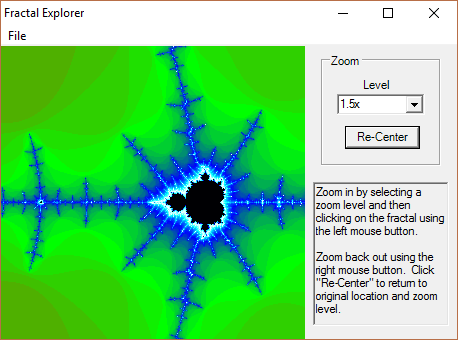
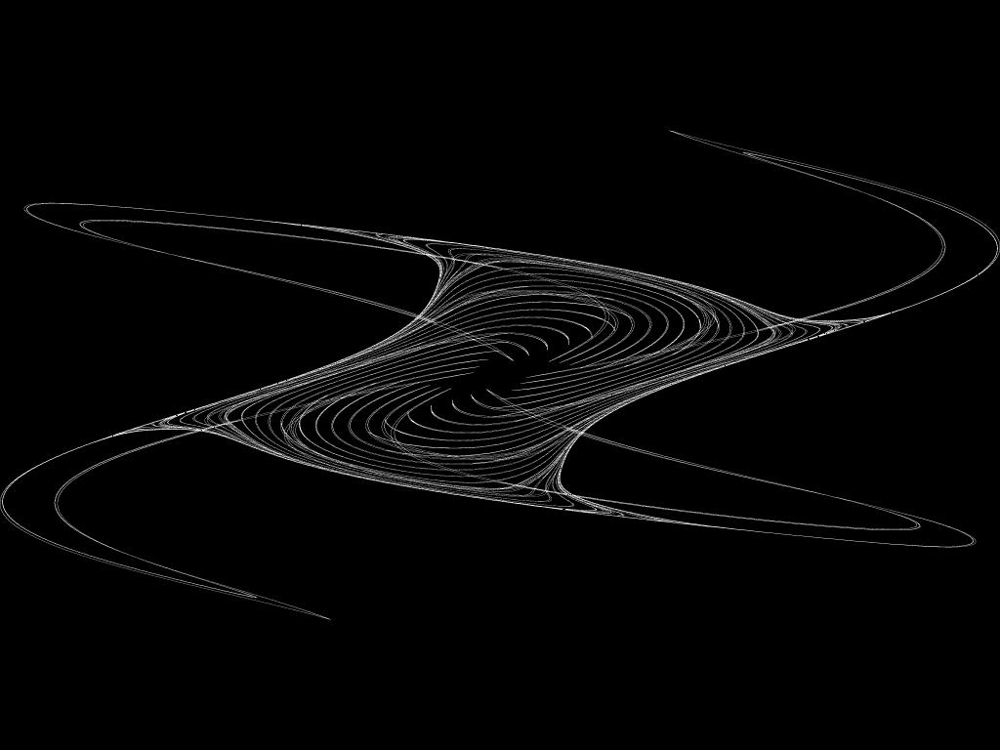
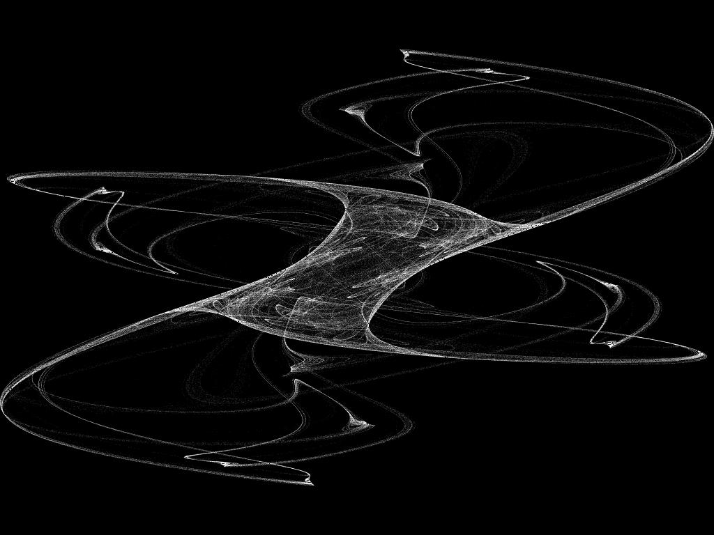
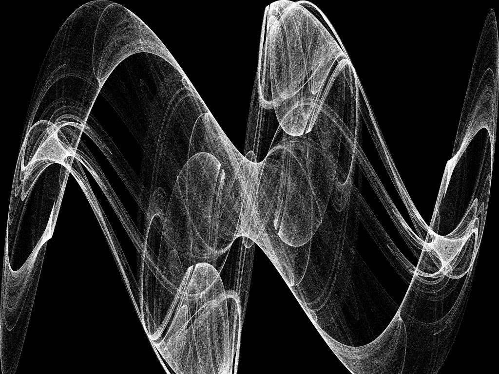

A couple fractal programs I wrote in the early 2000s-ish.

FractalExplore is a mandelbrot explorer:

I don't remember what "fractal" actually is, but it made cool fractals:

... and more in the fractal/ directory.
